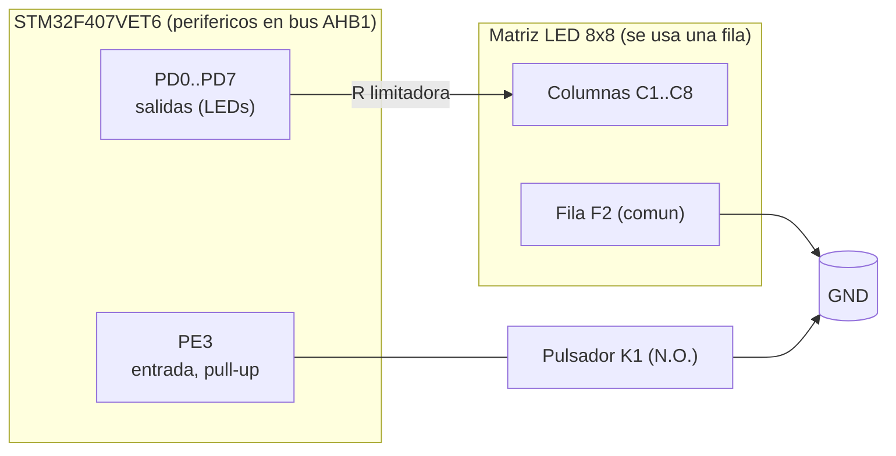

# Diagrama de bloques del hardware

---

Autor: Gildardo E. Restrepo
Curso: Microcontroladores
Semestre: 2026-02

---

## 1. Diagrama de bloques

## 2. Asignación de pines

| Señal STM32 | Pin | Función | Conecta a |
|---|---|---|---|
| Salidas LEDs | PD0 … PD7 | 8 salidas digitales | Columnas C1 … C8 de la matriz (vía R limitadora) |
| Retorno LEDs | — | común | Fila F2 → GND |
| Entrada botón | PE3 | entrada con pull-up interno | Pulsador K1 (N.O.); otro extremo a GND |

## 3. Notas eléctricas  [PERSONALIZA]

- **Resistencia limitadora**: Resistencia de ~330 Ω al cátodo común de la fila de LEDs, para ~10 mA a 3.3 V. Puesto que el juego
  enciende **un solo LED a la vez** no hay otro tipo de caidas de tensión, de modo que el brillo es el mismo.
- **Botón activo-bajo**: con pull-up interno, en reposo PE3 lee `1`; al pulsar, `0`.
- **Alimentación**: A través de la salida 3.3[V] que trae incroporado el STLink.  

