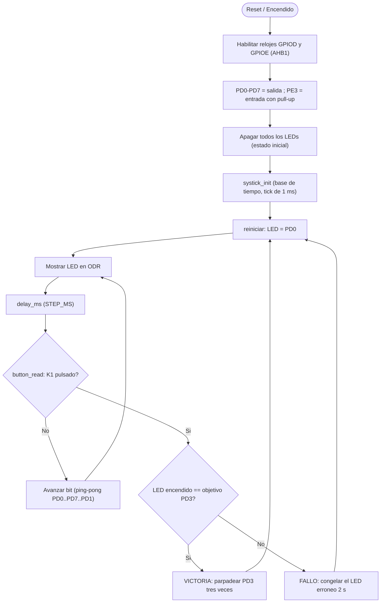
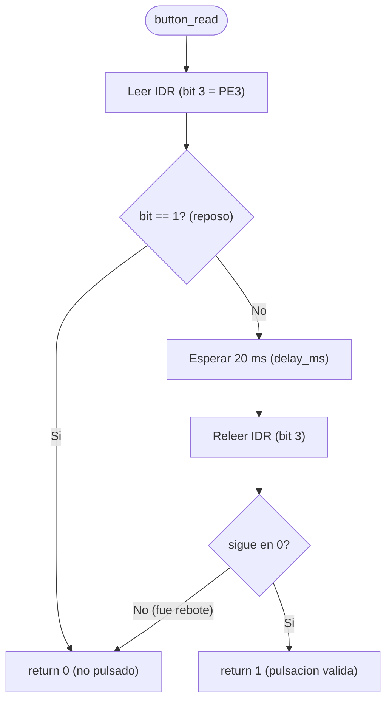

# Diagrama de flujo del software

---

Autor: Gildardo E. Restrepo
Curso: Microcontroladores
Semestre: 2026-02

---

## 1. Lógica general del juego

## 2. Técnica de debouncing (rutina `button_read`)

## 3. Notas 

- **Inicialización**: El orden de arranque no es arbitrario. Primero se **habilita el reloj** de los puertos en RCC (GPIODEN para los LEDs, GPIOEEN para el botón): un periférico sin reloj no responde a las escrituras, así que esto va antes de cualquier configuración. Con el reloj activo se define el **modo** de los pines (PD0–PD7 como salida en MODER; PE3 como entrada con pull-up en PUPDR). Luego se **apagan todos los LEDs** escribiendo 0 en ODR, garantizando el estado inicial que exige el reto tras energizar o resetear. Por último se inicializan la **base de tiempo (SysTick)** y el **botón**, porque el bucle de juego depende de `delay_ms` y `button_read`. [src/main.s]
- **Rutina de barrido**: Se definen dos funciones de barrido para el avance y el rebote (llamadas barrido y retorno, respectivamente). Tras llegar a PD07 y sin la lógica de juego interrumpida, en lugar de retornar a PD0 se vuelve a PD6 y se inicia un barrido hacia la izquierda con la misma estructura de comparación que el barrido original. Al finalizar **retorno** llama a **barrido** para reiniciar el proceso.     
- **Debouncing**: Para evitar lecturas erróneas del botón debido a efectos mecánicos, el debouncing actúa como un proceso de doble verificación, evaluando el estado en dos momentos separados en el tiempo por 20ms (criterio técnico de diseño). [src/button.s]
- **Evaluación acierto/fallo**: El registro r4 es quien hace las veces de variable que almacena el LED actual encendido. Tras confirmar la lectura del botón mientras se ejecuta el barrido/rebote (con la técanica de debouncing), se entra en el bloque de evaluación que contiene 3 funciones: evaluar, fallo y victoria. Evaluar compara el registro r4 con el led objetivo y según dicho resultado se va hacia, o bien al bloque fallo, o bien al de victoria. Ambos bloques vuelven (b reiniciar) al bucle principal de juego. [src/main.s]
